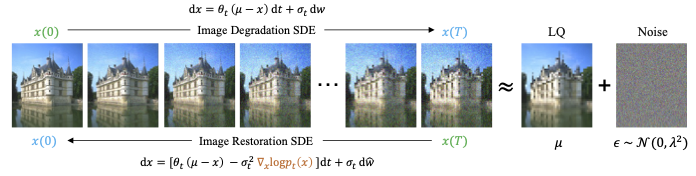
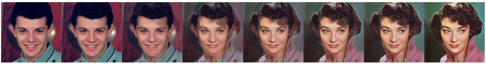

## Image Restoration SDE <br><sub>Official PyTorch Implementations of [[IR-SDE]](https://proceedings.mlr.press/v202/luo23b.html)(ICML 2023) and [[Refusion]](https://arxiv.org/abs/2304.08291)(CVPRW 2023). </sub>

[Ziwei Luo](https://algolzw.github.io/), 
[Fredrik K. Gustafsson](https://www.fregu856.com/), 
[Zheng Zhao](https://zz.zabemon.com/), 
[Jens Sjölund](https://jsjol.github.io/), 
[Thomas B. Schön](https://user.it.uu.se/~thosc112/index.html)</br>
Department of Information Technology, Uppsala University</br>

**[Image Restoration with Mean-Reverting Stochastic Differential Equations](https://proceedings.mlr.press/v202/luo23b.html)** [[Weights and Results](https://drive.google.com/drive/folders/14SvJXvp0HPKFHpGaaHy7h2I2fkRnIXAG?usp=share_link)]</br>


**[Refusion: Enabling Large-Size Realistic Image Restoration with Latent-Space Diffusion Models](https://arxiv.org/abs/2304.08291)** [[Weights and Results](https://drive.google.com/drive/folders/1Xy7z9CH0weck775ixePnjD6fZIjAbre7?usp=share_link)]</br>


Both methods can be used for synthetic and real-world datasets. You can find more details and results from this **[Project page](https://algolzw.github.io/ir-sde/index.html)**.

### Updates
[**2024.04.15**] Updated a [posterior sampling](https://github.com/Algolzw/image-restoration-sde/blob/8c03a712f81f30db72338ff8a8000ae89ce29f68/codes/utils/sde_utils.py#L284) approach for better image generation. See paper [Photo-Realistic Image Restoration in the Wild with Controlled Vision-Language Models](https://arxiv.org/abs/2404.09732) for more details. <br>
[**2023.10.02**] We present a new *Universal Image Restoration* framework by controlling vision-language models [[here]](https://github.com/Algolzw/daclip-uir).<br>
[**2023.07.06**] All results and pre-trained models for IR-SDE and Refusion are provided in [link1](https://drive.google.com/drive/folders/14SvJXvp0HPKFHpGaaHy7h2I2fkRnIXAG?usp=share_link) and [link2](https://drive.google.com/drive/folders/1T5_UL4BgOIftEEkAzoa-SYX49P7COVa6?usp=share_link), respectively.<br>
[**2023.04.25**] 🎉🎉🎉 **Our [IR-SDE](https://proceedings.mlr.press/v202/luo23b.html) paper was accepted by ICML 2023** 🎉🎉🎉<br>
[**2023.04.23**] We released the codes for various tasks (including *IR-SDE*, *Refusion*, and *Latent-Refusion*).<br>
[**2023.04.17**] 🎉🎉🎉 Our method **Refusion** is the **Winning Solution** in NTIRE 2023 Image Shadow Removal Challenge [[Paper]](https://arxiv.org/abs/2304.08291).<br>
<!--[**2023.02.02**] We provide a [Gradio](https://gradio.app/) app file for the case that you want to [test your own images](https://github.com/Algolzw/image-restoration-sde#Gradio).-->

## Dependenices

* OS: Ubuntu 20.04
* nvidia :
	- cuda: 11.7
	- cudnn: 8.5.0
* python3
* pytorch >= 1.13.0
* Python packages: `pip install -r requirements.txt`

## How to use our Code?

Here we provide an example for **image deraining** task, but can be changed to any problem with replacing the dataset. And the code for Denoising-SDE/ODE will be released later!

We retrained the deraining model from scratch on 4 Nvidia TITAN XP GPUs and find that it achieves a **new SOTA even in terms of PSNR** on Rain100H:

| Method |  PSNR   | SSIM  | LPIPS   | FID  |
| :--- |  :----:  | :----:  | :----:  | :----:  |
| **IR-SDE** | **31.65**  | **0.9041** | **0.047** | **18.64** |
| Restormer | 31.46  | 0.904 | - | - |
| MPRNet | 30.41 | 0.8906 | 0.158 | 61.59 |
| PReNet | 29.46 | 0.8990 | 0.128 | 52.67 |

Note that **we didn't tune any parameter**, the last saved checkpoint was used to evaluation.

The pretrained models for all tasks are provided [here](https://drive.google.com/drive/folders/14SvJXvp0HPKFHpGaaHy7h2I2fkRnIXAG?usp=share_link), and the performances of other SOTAs can be find in [here](https://paperswithcode.com/sota/single-image-deraining-on-rain100h).

### For Refusion Model

Note that if you want to train/test the Refusion model, the only change is to replace the "**ir-sde.yml**" to "**refusion.yml**". More details please refer to the "demo.sh" bash script in each task's directory.

### Dataset Preparation

We employ Rain100H datasets for training (totally 1,800 images) and testing (100 images). 

Download [training](http://www.icst.pku.edu.cn/struct/att/RainTrainH.zip) and [testing](http://www.icst.pku.edu.cn/struct/att/Rain100H.zip) datasets and process it in a way such that rain images and no-rain images are in separately directories, as

```bash
#### for training dataset ####
datasets/rain/trainH/GT
datasets/rain/trainH/LQ


#### for testing dataset ####
datasets/rain/testH/GT
datasets/rain/testH/LQ

```

Then get into the `codes/config/deraining` directory and modify the dataset paths in option files in 
`options/train/ir-sde.yml` and `options/test/ir-sde.yml`.


### Train
The main code for training is in `codes/config/deraining` and the core algorithms for IR-SDE is in `codes/utils/sde_utils.py`.

You can train the model following below bash scripts:

```bash
cd codes/config/deraining

# For single GPU:
python3 train.py -opt=options/train/ir-sde.yml

# For distributed training, need to change the gpu_ids in option file
python3 -m torch.distributed.launch --nproc_per_node=2 --master_poer=4321 train.py -opt=options/train/ir-sde.yml --launcher pytorch
```

Then the models and training logs will save in `log/derain_sde/`. 
You can print your log at time by running `tail -f log/derain_sde/train_derain_sde_***.log -n 100`.

### Evaluation
To evaluate our method, please modify the benchmark path and model path and run

```bash
cd codes/config/deraining
python test.py -opt=options/test/ir-sde.yml
```

We also provide the results for different tasks [here](https://drive.google.com/drive/folders/14SvJXvp0HPKFHpGaaHy7h2I2fkRnIXAG?usp=share_link).

### Gradio
Here we provide an [app.py](https://github.com/Algolzw/image-restoration-sde/blob/main/codes/config/deraining/app.py) file for testing your own images. Before that, you need to download the pretrained weights and modify the model path in `test_sde_derain.yml`. Then by simply running `python app.py`, you can open `http://localhost:7860` to test the model. (We also provide 3 raining images from Rain100H in `images` dir).

### Some Results

<div align='center'>HR Non-Homogeneous Dehazing</div>


<div align='center'>Image Shadow Removal</div>


### Interpolation
We also provide a interpolation demo to perform interpolation between two images in `codes/demos/interpolation.py`, the usage is:

```bash
cd codes/demos
python interpolation.py -s source_image_path -t target_image_path --save save_dir
```

#### Example of interpolation:



## Citations
If our code helps your research or work, please consider citing our paper.
The following are BibTeX references:

```
@article{luo2023image,
  title={Image Restoration with Mean-Reverting Stochastic Differential Equations},
  author={Luo, Ziwei and Gustafsson, Fredrik K and Zhao, Zheng and Sj{\"o}lund, Jens and Sch{\"o}n, Thomas B},
  journal={International Conference on Machine Learning},
  year={2023},
  organization={PMLR}
}

@inproceedings{luo2023refusion,
  title={Refusion: Enabling Large-Size Realistic Image Restoration with Latent-Space Diffusion Models},
  author={Luo, Ziwei and Gustafsson, Fredrik K and Zhao, Zheng and Sj{\"o}lund, Jens and Sch{\"o}n, Thomas B},
  booktitle={Proceedings of the IEEE/CVF Conference on Computer Vision and Pattern Recognition Workshops},
  pages={1680--1691},
  year={2023}
}
```

---

#### Contact
E-mail: ziwei.luo@it.uu.se

#### --- Thanks for your interest! --- ####

